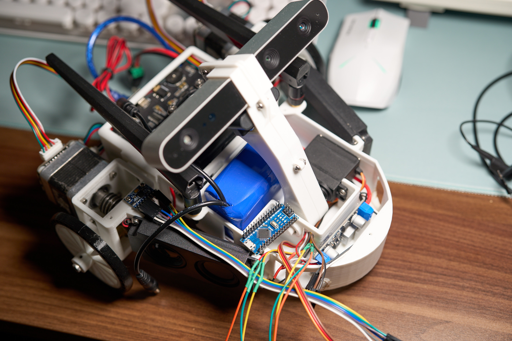
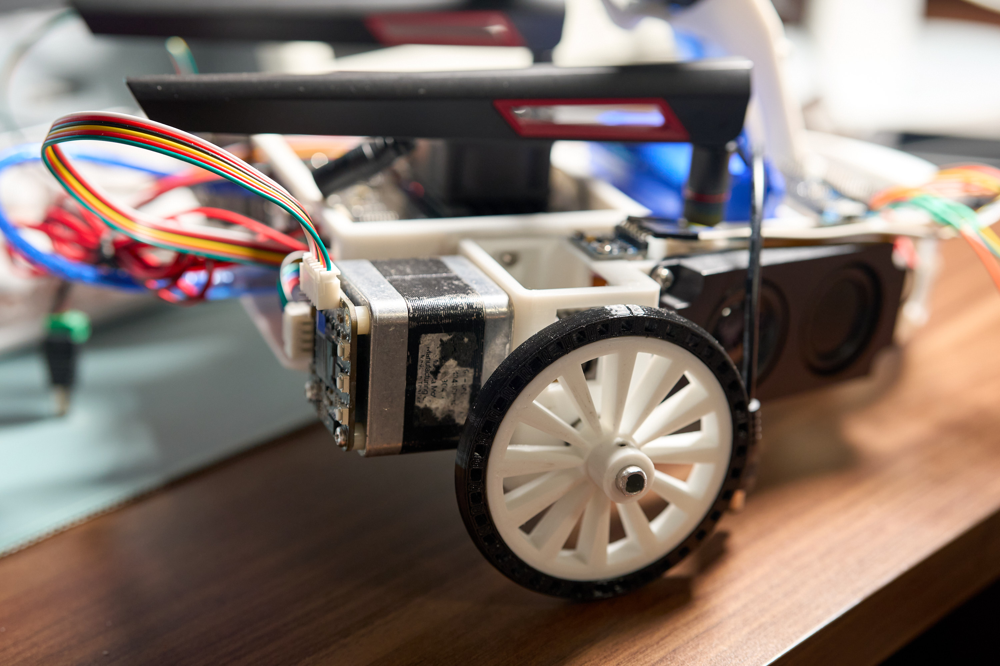
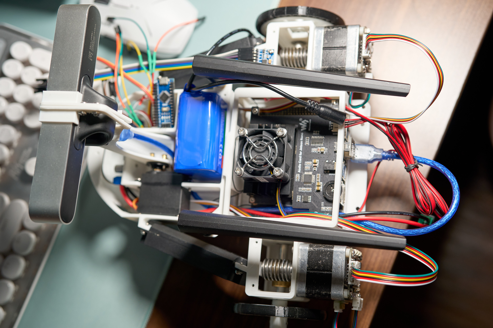
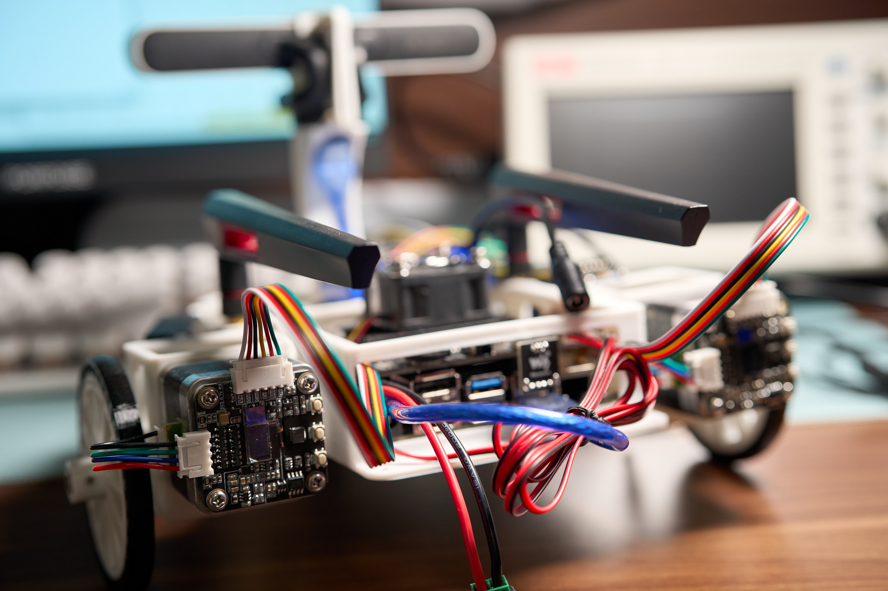

# 一台狗狗伴侣
## JetBot
自制JetBot，含视觉、交互语音、交互小屏
整理了一下物料表，本以为可以省钱，发现物料成本已经高达2600软妹币，价格已经略高于jetRacer，果然样机不如量产，不得不相信人民的力量。    
### 装配图：

//Todo 编写arduino串口通信电机控制、MPU6050位姿解析
## Hotdog
//Todo 山寨一台便宜的四足机器狗        
